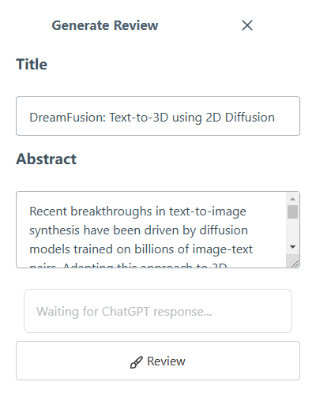
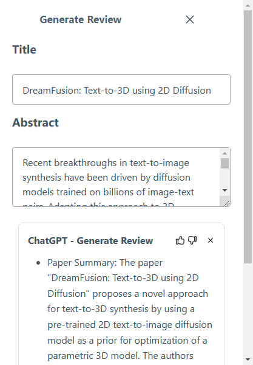
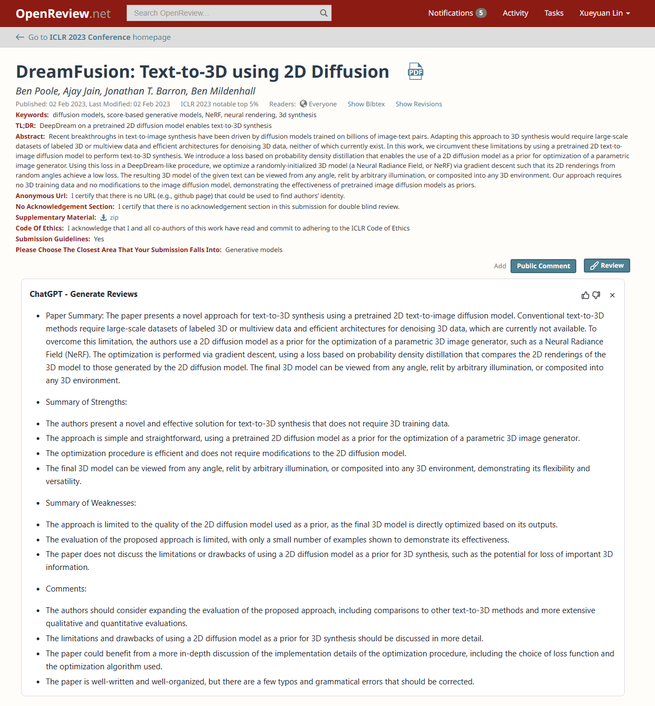
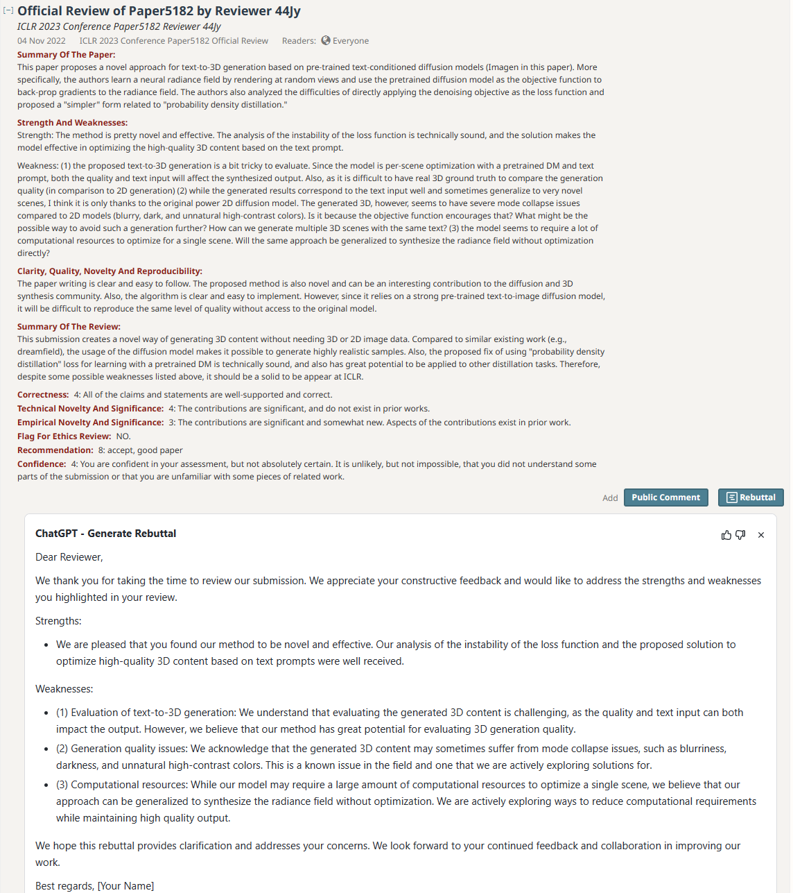

# ChatGPT for generating Reviews & Rebuttals

A browser extension for generating reviews and rebuttals in [openreview](https://openreview.net/), powered by [ChatGPT]().

**Project status:** Beta - Bugs likely - If you run into issues or have feature suggestions --> Submit them as an issue!

## Screenshot Gallery

**ChatGPT - Generate Review**

generate review in panel

inject to openreview.net

**ChatGPT - Generate Rebuttal**

inject to openreview.net

## Installation

### Install to Chrome/Edge

#### Install from Chrome Web Store (Preferred)

https://chrome.google.com/webstore/detail/chatgpt-review-rebuttal-ai-assist/dlipncbkjmjjdpgcnodkbdobkadiejll

#### Local Install

1. Download `chromium.zip` from [Releases](https://github.com/LinXueyuanStdio/chatgpt-review-rebuttal-extension/releases).
2. Unzip the file.
3. In Chrome/Edge go to the extensions page (`chrome://extensions` or `edge://extensions`).
4. Enable Developer Mode.
5. Drag the unzipped folder anywhere on the page to import it (do not delete the folder afterwards).

### Install to Firefox

#### Local Install

1. Download `firefox.zip` from [Releases](https://github.com/LinXueyuanStdio/chatgpt-review-rebuttal-extension/releases).
2. Unzip the file.
3. Go to `about:debugging`, click "This Firefox" on the sidebar.
4. Click "Load Temporary Add-on" button, then select any file in the unzipped folder.

## Build from source

1. Clone the repo
2. Install dependencies with `npm`
3. `npm run build`
4. Load `build/chromium/` or `build/firefox/` directory to your browser

## Issues & Feature requests

Please report any issues or feature requests on the GitHub Issue tab. I will try to respond as soon as possible!

## Outstanding items & Future plans

- [x] Refactor prompt engineering
- [ ] Add shortcuts

## Major Acknowledgements

- [ChatGPT](https://openai.com/blog/chatgpt/) for doing all the heavy lifting.
- [wong2/chat-gpt-google-extension](https://github.com/wong2/chat-gpt-google-extension) for serving as a base for the extension. The entire backend integration with ChatGPT is built by them and I use it as-is (including the readme instructions below). It is phenomenal work and I highly recommend checking it out.
- [TiesdeKok/chat-gpt-jupyter-extension](https://github.com/TiesdeKok/chat-gpt-jupyter-extension) for serving as a base for the extension.